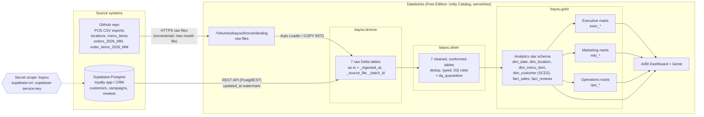

# Architecture

## Layers

| Layer | Purpose | Rules |
|-------|---------|-------|
| **Bronze** | Raw copy of every source, append-only | Keep every column as delivered (strings where the source is messy), add `_ingested_at`, `_source_file` / `_source_system`, `_batch_id`. No filtering. |
| **Silver** | Clean, typed, deduplicated, conformed | Fix every issue in the DQ log. Bad rows are quarantined, not dropped silently. Latest version per key wins. |
| **Gold** | Business-ready, per team | Star schema for analytics, plus executive, marketing and operations marts built on top of it. |

## Incremental story

- **Orders / order items** arrive as one CSV per month. Loading month by month shows Auto Loader picking up only new files, the late-arriving January orders in the February file, and duplicates that MERGE must resolve.
- **Customers** carry `updated_at`. The first load is full; later loads pull `updated_at > last watermark`. `supabase/updates/2026_07_01_tier_changes.sql` creates the change batch that drives SCD Type 2 in `gold.dim_customer`.
